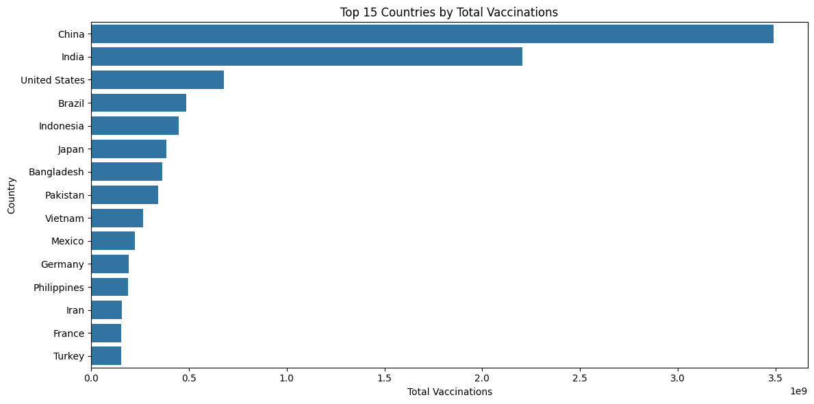
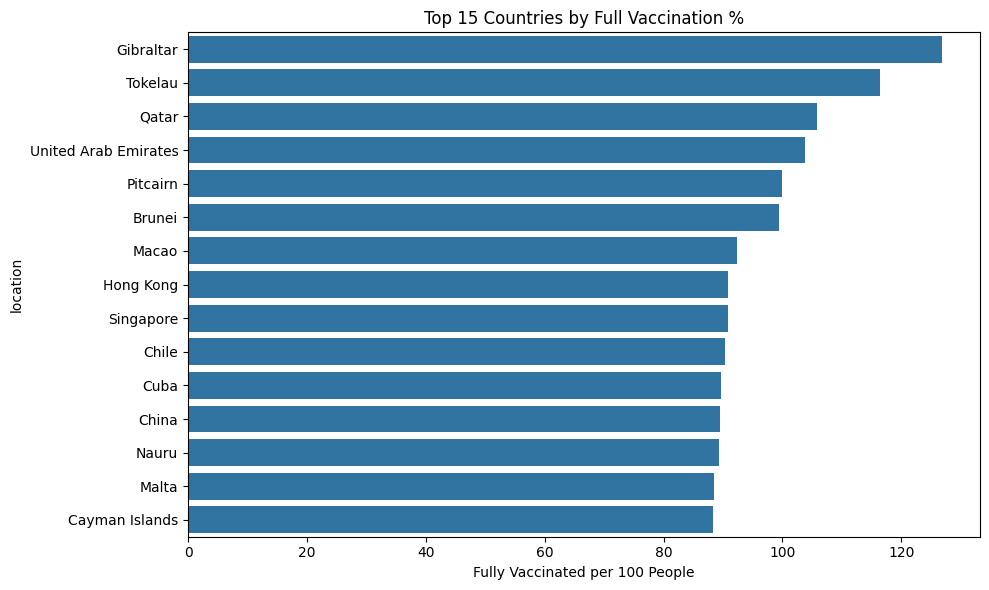

# 
 Global COVID-19 Vaccination Analysis 

# 1. Introduction

This project focuses on analyzing global COVID-19 vaccination data using Exploratory Data Analysis (EDA) techniques to examine patterns in vaccination coverage, speed, vaccine types, and disparities.

# 2. Dataset Overview

- Dataset Source: https://www.nature.com/articles/s41562-021-01122-8 
- Rows: 196246
- Columns: 16

- 
    ## 2.1. Dataset Description

    Country-by-country data on global COVID-19 vaccinations. We only rely on figures that are verifiable based on public official sources.

    This dataset includes some subnational locations (England, Northern Ireland, Scotland, Wales, Northern Cyprus…) and international aggregates (World, continents, European Union…). They can be identified by their iso_code that starts with OWID_.

- 
    ## 2.2. Columns Description
    | Column Name | Description |
    | :------- | :------- |
    | location | Name of the country (or region within a country) |
    | iso_code | ISO 3166-1 alpha-3 – three-letter country codes |
    | date | Date of the observation |
    | total_vaccinations | Total number of doses administered. For vaccines that require multiple doses, each individual dose is counted. If a person receives one dose of the vaccine, this metric goes up by 1. If they receive a second dose, it goes up by 1 again. If they receive a third/booster dose, it goes up by 1 again |
    | people_vaccinated | Total number of people who received at least one vaccine dose. If a person receives the first dose of a 2-dose vaccine, this metric goes up by 1. If they receive the second dose, the metric stays the same |
    | people_fully_vaccinated | Total number of people who received all doses prescribed by the initial vaccination protocol. If a person receives the first dose of a 2-dose vaccine, this metric stays the same. If they receive the second dose, the metric goes up by 1 |
    | total_boosters | Total number of COVID-19 vaccination booster doses administered (doses administered beyond the number prescribed by the initial vaccination protocol) |
    | daily_vaccinations_raw | Daily change in the total number of doses administered. It is only calculated for consecutive days. This is a raw measure provided for data checks and transparency, but we strongly recommend that any analysis on daily vaccination rates be conducted using daily_vaccinations instead |
    | daily_vaccinations | New doses administered per day (7-day smoothed). For countries that don't report data on a daily basis, we assume that doses changed equally on a daily basis over any periods in which no data was reported. This produces a complete series of daily figures, which is then averaged over a rolling 7-day window |
    | total_vaccinations_per_hundred | total_vaccinations per 100 people in the total population of the country |
    | people_vaccinated_per_hundred | people_vaccinated per 100 people in the total population of the country |
    | people_fully_vaccinated_per_hundred | people_fully_vaccinated per 100 people in the total population of the country |
    | total_boosters_per_hundred | total_boosters per 100 people in the total population of the country |
    | daily_vaccinations_per_million | daily_vaccinations per 1,000,000 people in the total population of the country |
    | daily_people_vaccinated | daily number of people receiving a first COVID-19 vaccine dose (7-day smoothed) |
    | daily_people_vaccinated_per_hundred | daily_people_vaccinated per 100 people in the total population of the country |

# 3. Data Cleaning

- Missing values: 1109395 null/missing values found.
- Duplicate values: No duplicated values found.
- Converted the ‘date’ column to datetime format.
- Removed unnecessary and unwanted columns from the dataset.
- Removed rows with missing values from critical numeric column.
- Drop aggregates like "World", "Asia", etc from the ‘locations’ column.
- Replaced all ‘NaN’ values with ‘0’, stating that zero people were vaccinated that day.

# 4. Exploratory Data Analysis

- Sorted data according to the latest data per country.
- Created binary target: 1 if fully vaccinated ≥ 70%.
- Top 15 countries by total vaccinations:

- Top countries by fully vaccinated per hundred: 

- 
    ## 4.1. Univariant Analysis

    Univariate analysis looked at one feature at a time to understand the distributions:

    - High skewness was observed in vaccination metrics like:

        - total_vaccinations
        - people_fully_vaccinated_per_hundred
        - daily_vaccinations_per_million

    - A large number of missing values were initially present in columns like total_boosters, people_fully_vaccinated, etc., which were cleaned before deeper analysis.

    - Countries like India, USA, and China stood out with very high total vaccination counts.

    - Smaller nations (e.g., Gibraltar, Falkland Islands) dominated in terms of per-hundred vaccination rates, showing high relative performance despite smaller population sizes.

- 
    ## 4.2. Multivariant Analysis

    Multivariate analysis explored relationships between multiple variables:

    - Correlation Heatmap revealed:
    
        - Strong correlation between total_vaccinations and     people_vaccinated_per_hundred.
        - daily_people_vaccinated_per_hundred and daily_vaccinations_per_million    were also strongly related.
    
    - Boxplot Analysis:
    
        - Substantial variation in total vaccinations across the top 10 countries.
        - Some countries had extremely high totals, creating long tails in  distribution.
    
    - Groupwise Aggregation:
    
        - Countries like China, India, USA lead in average total vaccinations.
    
    - Binary Classification:
    
        - A binary column achieved_70_percent was created.
        - Class distribution:
            - 81 countries achieved ≥70% full vaccination.
            - 140 countries did not.

# 5. Key Insights

- Countries with multiple vaccine types had faster rollouts.
- Some countries had inconsistent or missing reporting.
- Countries like India, USA, China ranks highest by total vaccinations.
- Small nations such as Gibraltar, Falkland Islands often lead in per-capita vaccination.
- Per-hundred vaccination is a better relative indicator of progress than total doses.
- Daily vaccination trends can be studied using line plots per country over time.

# 6. Machine Learning Model Suggestion

Based on EDA:

1)	Forecast future vaccinations for a country.
    - LSTM model will be best suited for this dataset.
    - LSTM captures temporal dependencies and trends well.

2)	Classify countries into "High", "Medium", "Low" vaccination rollout categories.
    - Random Forest Classifier will be best suited for this dataset.
    - Random Forest handles multi-class problems and categorical data.
    - Random Forest provides feature importance.
    - Random Forest handles nonlinear relationships.
    - Random Forest works well with no strict assumptions.

# 7. Conclusion

This EDA uncovers critical global trends in the COVID-19 vaccine rollout. The analysis not only visualizes the massive global effort but also highlights gaps in equity, infrastructure, and availability. It prepares the dataset for predictive modeling in public health planning.

# 8. References

- Dataset: https://www.nature.com/articles/s41562-021-01122-8 
- Tools: Python (Pandas, Matplotlib, Seaborn)
