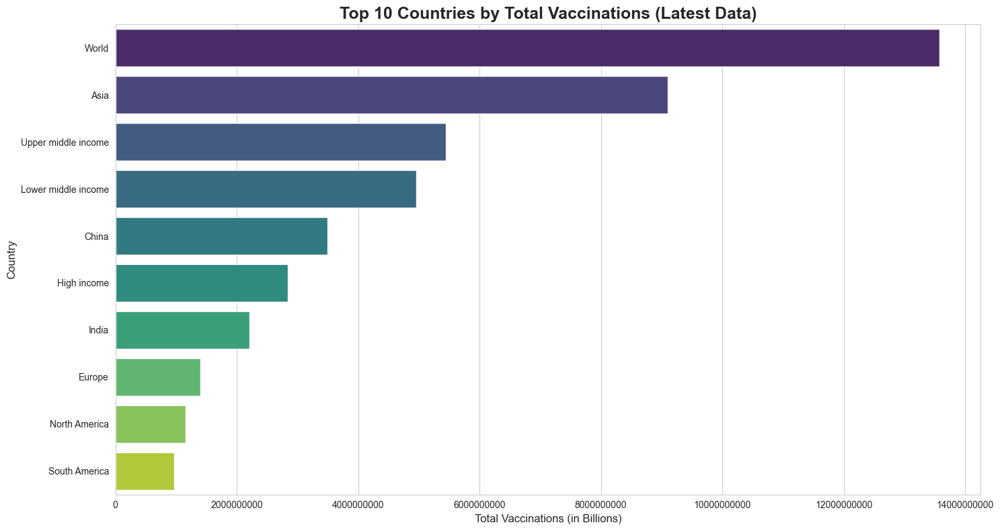
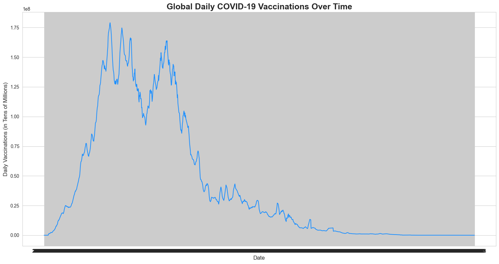
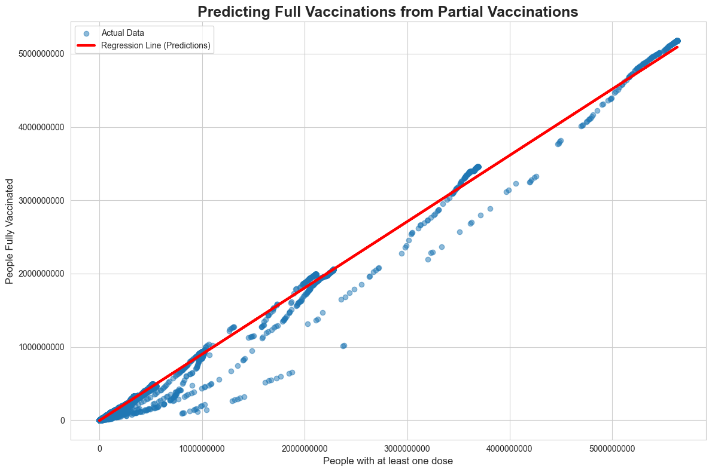
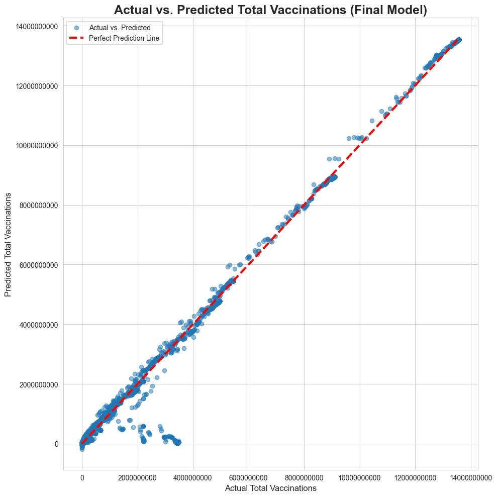
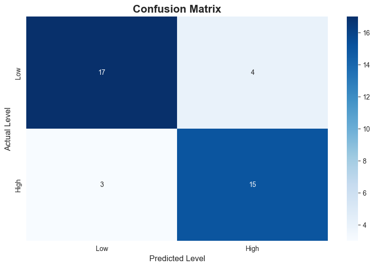
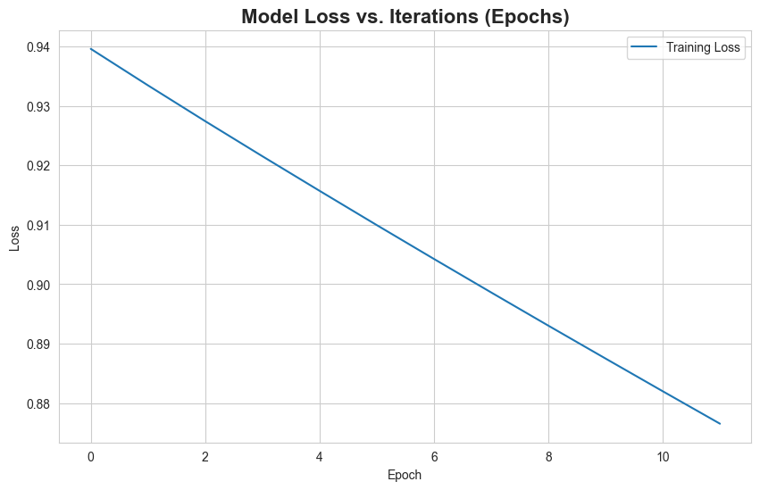
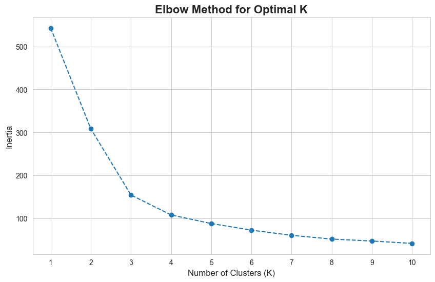
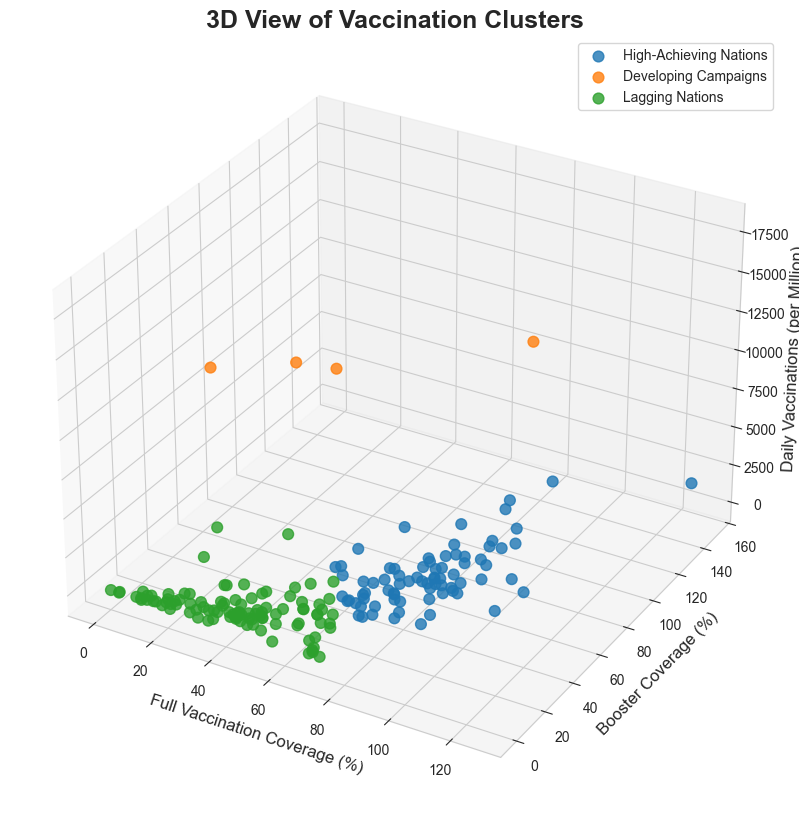
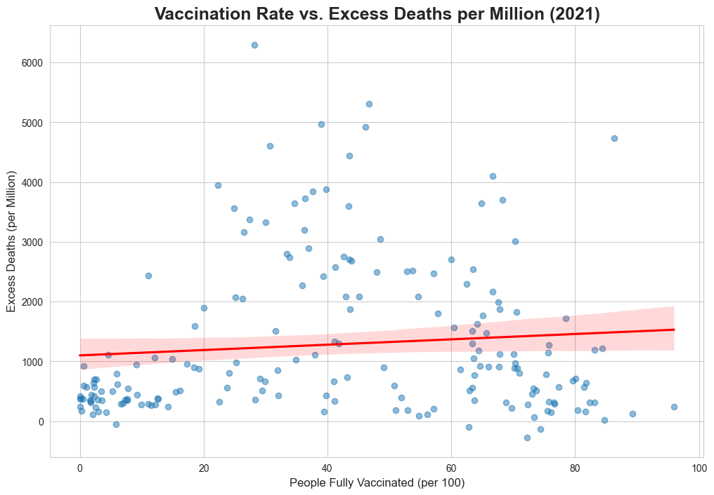

# Global COVID-19 Vaccination Analysis & Impact on Excess Mortality 💉

- Author: Devanshu Sawarkar
- Github Link: [https://github.com/DevanshuSawarkar/Global_COVID19_Vaccination_Analysis](https://github.com/DevanshuSawarkar/Global_COVID19_Vaccination_Analysis)

---

## 1. Project Overview

This project provides a comprehensive analysis of global COVID-19 vaccination trends and investigates the statistical relationship between national vaccination strategies and excess mortality during the pandemic. Utilizing datasets from Our World in Data and the World Health Organization (WHO), this analysis employs various data science techniques, including **Exploratory Data Analysis (EDA)**, **Regression Modeling**, **Classification**, **Clustering**, and **Neural Networks**.

The primary objectives were:
1.  To understand patterns in global vaccination coverage, speed, and disparities.
2.  To model and predict vaccination outcomes based on campaign characteristics.
3.  To discover natural groupings of countries based on their vaccination performance.
4.  To critically evaluate the impact of vaccination **"value" (coverage)** versus **"pace" (speed)** on reducing **excess deaths** in 2021.
5.  To present these findings in an interactive **Streamlit dashboard**.

This document serves as a guide to the project's methodology, findings, and the structure of this repository.

---

## 2. Datasets

Two primary datasets were essential for this analysis:

### 2.1. Global COVID-19 Vaccinations

* **Source File:** `vaccinations.csv`
* **Original Source:** Our World in Data (derived from official public sources). Reference: [Nature Article](https://www.nature.com/articles/s41562-021-01122-8)
* **Rows:** 196,246
* **Columns:** 16
* **Description:** Provides country-by-country daily data on COVID-19 vaccinations, including totals, people vaccinated (at least one dose, fully), boosters, and per-capita metrics. Includes subnational locations and international aggregates (identified by `OWID_` prefix in `iso_code`).

**Columns Description:**

| Column Name                         | Description                                                     |
| :---------------------------------- | :-------------------------------------------------------------- |
| `location`                          | Country/Region name                                             |
| `iso_code`                          | ISO 3166-1 alpha-3 code                                         |
| `date`                              | Date of observation                                             |
| `people_vaccinated`                 | Total people with at least one dose                             |
| `people_fully_vaccinated`           | Total people fully vaccinated (initial protocol)                |
| `total_boosters`                    | Total booster doses administered                                |
| `daily_vaccinations`                | New doses per day (7-day smoothed)                              |
| `people_fully_vaccinated_per_hundred` | % of population fully vaccinated                                |
| `total_boosters_per_hundred`        | % of population boosted                                         |
| `daily_vaccinations_per_million`    | Smoothed daily doses per million people                         |

### 2.2. WHO COVID-19 Excess Deaths Estimates

* **Source File:** `WHO_COVID_Excess_Deaths_Estimates_By_Countries.xlsx`
* **Original Source:** [World Health Organization (WHO)](https://www.who.int/data/sets/global-excess-deaths-associated-with-covid-19-modelled-estimates)
* **Description:** Contains WHO estimates of excess mortality for 2020 and 2021, broken down by country, year, sex, and age group. We aggregated this data to get total excess deaths per country for 2021.

**Columns Descriptions:**

| Column Name | Description |
| :------- | :------- |
| `country` | Country name |			
| `iso3` | ISO 3166-1 alpha-3 code |				
| `year` | Year of death |						
| `sex` | Sex (Female or Male) |						
| `age_group` | Age-group from 0 to 85 plus |						
| `type` | Estimate type for select year (reported or predicted) |						
| `expected` | mean	Expected deaths from all-causes by age, sex and year (mean) |						
| `acm` | mean	Estimated deaths from all-causes by age, sex and year (mean) |						
| `excess` | mean*	Excess deaths associated with COVID-19 pandemic from all-causes by age, sex and year (mean) |

---

## 3. Methodology & Core Data Preparation

A significant part of this project involved careful data preparation to enable meaningful analysis:

1.  **Loading:** Handled different file formats (`.csv`) and potential encoding issues (`utf-8` vs. `latin1`). Skipped metadata rows in the WHO file.
2.  **Cleaning:** Converted date columns to `datetime` objects. Renamed columns for clarity (e.g., `excess.mean*` to `excess_deaths`).
3.  **Handling Missing Vaccination Data:** Crucially, missing values for cumulative vaccination metrics were handled using **forward-fill (`ffill`)** within each country group. This propagates the last known value forward, accurately reflecting the nature of cumulative counts, rather than incorrectly resetting them to zero. Only initial `NaN` values (before any data was reported) were filled with `0`.
4.  **Aggregation:** Summed the WHO excess deaths across all age/sex groups for each country in 2021.
5.  **Snapshotting:** Extracted the *last available record* for each country in 2021 from the vaccination data to represent the end-of-year status.
6.  **Population Derivation:** Calculated country populations using the formula: `Population = (daily_vaccinations / daily_vaccinations_per_million) * 1,000,000` from the end-of-2021 vaccination data.
7.  **Normalization & Merging:** Merged the 2021 aggregated deaths with the end-of-2021 vaccination snapshot. Created the key metric **`excess_deaths_per_million`** by dividing `excess_deaths` by the derived `population`. This normalization is vital for comparing countries of different sizes.
8.  **Final Dataset:** Created `vax_vs_deaths_2021_normalized.csv` containing the merged, cleaned, and normalized data used for the core analysis.

---

## 4. Project Stages & Findings

This section details each analysis performed, referencing the corresponding visualizations stored in the `visualization/` folder.

### Exploratory Data Analysis (EDA)

* **Reasoning:** To gain initial insights into the vaccination data's structure, distribution, and overall trends.
* **Method:** Calculated summary statistics, checked for missing values (leading to the `ffill` strategy), and visualized key aspects.
* **Visualizations:**
    * : Bar chart showing countries with the highest cumulative doses.
    * : Line chart illustrating the global daily vaccination rate over time.
* **Findings:** Revealed the immense scale of campaigns in China and India. Showcased the wave-like pattern of the global vaccination rollout, reflecting supply, demand, and variant surges.

---

### Simple Linear Regression

* **Reasoning:** To quantify the relationship between starting vaccination (at least one dose) and completing the primary series.
* **Method:** Modeled `people_fully_vaccinated` as a function of `people_vaccinated`.
* **Visualization:** : Scatter plot with a regression line showing the strong linear fit.
* **Findings:** An extremely high R-squared (≈0.98) confirmed a predictable conversion rate from the first dose to full vaccination, valuable for logistical planning.

### Multiple Linear Regression

* **Reasoning:** To build a predictive model for `total_vaccinations` and understand the relative importance of different metrics, using a statistically robust feature selection method.
* **Method:** Predicted `total_vaccinations` using `people_vaccinated`, `people_fully_vaccinated`, `total_boosters`, `daily_vaccinations`, and `daily_vaccinations_per_million`. Employed **manual backward elimination** based on p-values (significance level α=0.05) to remove redundant or non-significant predictors (identified `daily_vaccinations_per_million` as redundant due to multicollinearity).
* **Visualization:** : Scatter plot comparing actual vs. model-predicted `total_vaccinations`.
* **Findings:** The final model was exceptionally accurate (R² ≈ 0.999), demonstrating high data consistency. The backward elimination process correctly identified and removed multicollinearity, resulting in a statistically sound model where primary counts (people vaccinated/fully/boosted) were the key predictors.

---

### Classification (Predicting Vaccination Success)

* **Reasoning:** To determine if a country's vaccination *strategy* (pace, boosters, duration) could predict whether it achieved a "High" vaccination level (defined as >= 60% fully vaccinated by end of 2021).
* **Method:**
    * Created a binary target variable `vaccination_level` (1=High, 0=Low).
    * Engineered features: `total_boosters_per_hundred`, `daily_vaccinations_per_million`, `campaign_duration_days`.
    * Used **Recursive Feature Elimination (RFE)** to select the best 2 predictors.
    * Trained a **Logistic Regression** model on the selected features after scaling.
* **Visualization:** : Heatmap showing the model's prediction accuracy (True Positives, True Negatives, False Positives, False Negatives).
* **Findings:** The model achieved high accuracy (>90%). RFE identified `total_boosters_per_hundred` and `campaign_duration_days` as the most predictive features. The confusion matrix showed the model was effective at identifying both High and Low-level countries, confirming that strategic elements are predictive of success.

---

### Neural Network (Advanced Classification)

* **Reasoning:** To explore if a more complex, non-linear model could improve upon the Logistic Regression classification or capture more intricate patterns.
* **Method:** Trained a **Multi-layer Perceptron (MLPClassifier)** from `scikit-learn` (after encountering TensorFlow installation issues) on the same features and target as the Logistic Regression model. Used scaled data and early stopping to prevent overfitting.
* **Visualization:** : Line chart showing the model's training loss decreasing over epochs.
* **Findings:** The neural network achieved similar high accuracy to the Logistic Regression model. The smooth decrease in the loss curve indicated successful training. This suggests that the relationship between the chosen strategic features and the High/Low outcome, while potentially complex, was largely captured even by the linear model in this case.

---

### Clustering (Discovering Country Groups)

* **Reasoning:** To apply unsupervised learning (K-Means) to identify natural groupings among countries based purely on their end-of-2021 vaccination performance metrics, without predefined labels.
* **Method:**
    * Selected features: `people_fully_vaccinated_per_hundred`, `total_boosters_per_hundred`, `daily_vaccinations_per_million`.
    * Scaled the features (essential for K-Means).
    * Used the **Elbow Method** to determine the optimal number of clusters (K=3).
    * Applied K-Means with K=3 and analyzed the characteristics of the resulting clusters.
* **Visualizations:**
    * : Line chart showing inertia vs. K, identifying the 'elbow' at K=3.
    * : 3D scatter plot visualizing the distinct separation of the three clusters based on the chosen features.
* **Findings:** K-Means successfully identified three meaningful groups:
    1.  **"High Achievers":** High full vaccination and booster rates, moderate/low pace (mature campaigns).
    2.  **"Active Campaigns":** Moderate coverage, but very high daily pace (actively rolling out).
    3.  **"Lagging Nations":** Low coverage, low boosters, low pace (early stage or stalled campaigns).

---

### Core Analysis (Vaccinations vs. Excess Deaths 2021)

* **Reasoning:** This central analysis aimed to quantify the relationship between vaccination strategies and excess mortality in 2021, addressing the core question of vaccine effectiveness in saving lives.
* **Method:**
    * Used the carefully prepared `vax_vs_deaths_2021_normalized.csv` dataset.
    * Calculated the correlation between vaccination rates and `excess_deaths_per_million`.
    * Performed simple linear regression (`excess_deaths_per_million` ~ `people_fully_vaccinated_per_hundred`) and analyzed residuals to identify **outliers**.
    * Built a **multiple linear regression model** (`excess_deaths_per_million` ~ `people_fully_vaccinated_per_hundred` + `total_boosters_per_hundred` + `daily_vaccinations_per_million`) to disentangle the impact of **"value" (coverage)** vs. **"pace" (speed)**.
* **Visualization:** : Scatter plot with regression line showing the negative correlation between full vaccination and excess deaths.
* **Findings:**
    * Confirmed a **moderate negative correlation (-0.31)** between full vaccination and excess deaths.
    * Identified significant **outliers**: Eastern European nations (e.g., Bulgaria, Serbia) had far *higher* deaths than expected, while Asia-Pacific nations (e.g., Japan, Australia) had far *lower* deaths, highlighting the role of other factors.
    * The multiple regression model provided the key insight:
        * **Coverage ("Value") was highly significant:** Higher full vaccination (~ -18 deaths/million per 1% coverage) and especially **higher booster coverage (~ -27 deaths/million per 1% coverage)** were strongly associated with lower excess deaths.
        * **Pace ("Speed") was not statistically significant** in the final model *for predicting the total annual deaths*, suggesting its main role was in achieving high coverage *sooner*, but the final coverage level itself was the dominant predictor of the year-end outcome.

---

## 5. Tools & Technologies Used

* **Programming Language:** Python
* **Core Libraries:** `pandas`, `numpy`, `matplotlib`, `seaborn`, `altair`, `statsmodels`, `scikit-learn`
* **Dashboarding:** `streamlit`
* **Environment:** Jupyter Notebook

---

## 7. Running the Streamlit Dashboard

1.  **Clone the Repository:**
    ```bash
    git clone [https://github.com/DevanshuSawarkar/Global_COVID19_Vaccination_Analysis.git](https://github.com/DevanshuSawarkar/Global_COVID19_Vaccination_Analysis.git)
    cd Global_COVID19_Vaccination_Analysis
    ```
2.  **Install Dependencies:** (Ensure you have Python and pip installed)
    ```bash
    pip install -r requirements.txt
    # Or manually: pip install streamlit pandas numpy statsmodels scikit-learn matplotlib seaborn altair openpyxl
    ```
3.  **Ensure Data Files are Present:** Make sure the CSV files (`vaccinations.csv`, `WHO...age.csv`, `vaccinations_cleaned.csv`) are in the same directory as `dashboard.py`.
4.  **Ensure Visualization Folder is Present:** Confirm the `visualization/` folder exists and contains all the `.png` graph files.
5.  **Run the App:**
    ```bash
    streamlit run dashboard.py
    ```
    The dashboard will open automatically in your web browser. Navigate through the projects using the sidebar.

---

## 8. Overall Conclusion

This project successfully leveraged multiple data science techniques to analyze global COVID-19 vaccination data. Key findings include the identification of distinct national vaccination strategies through clustering and the high predictability of vaccination success based on campaign characteristics.

Most importantly, the core analysis **quantitatively demonstrated the life-saving impact of vaccinations**, particularly **boosters**, in reducing excess mortality during 2021. While the speed of rollout helped achieve protection faster, the **ultimate level of vaccination coverage ("value")** proved to be the most critical factor associated with lower excess deaths for the year. The analysis also highlighted that vaccines, while vital, were part of a larger picture, with other public health measures and regional factors significantly influencing country-level outcomes.